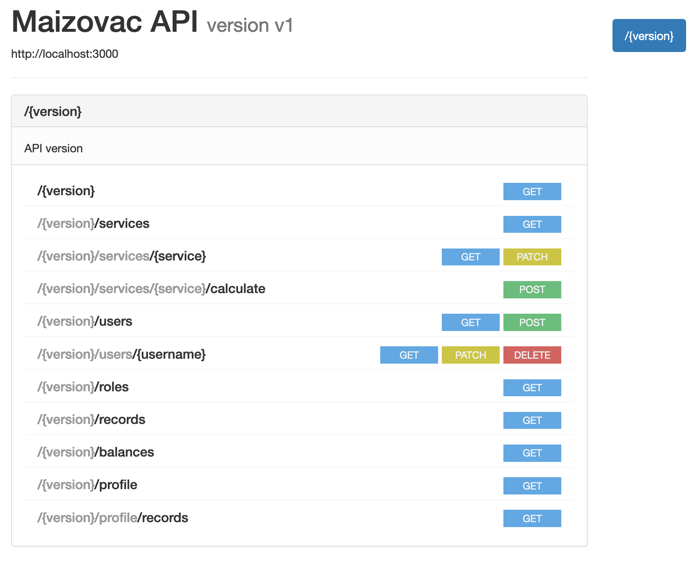
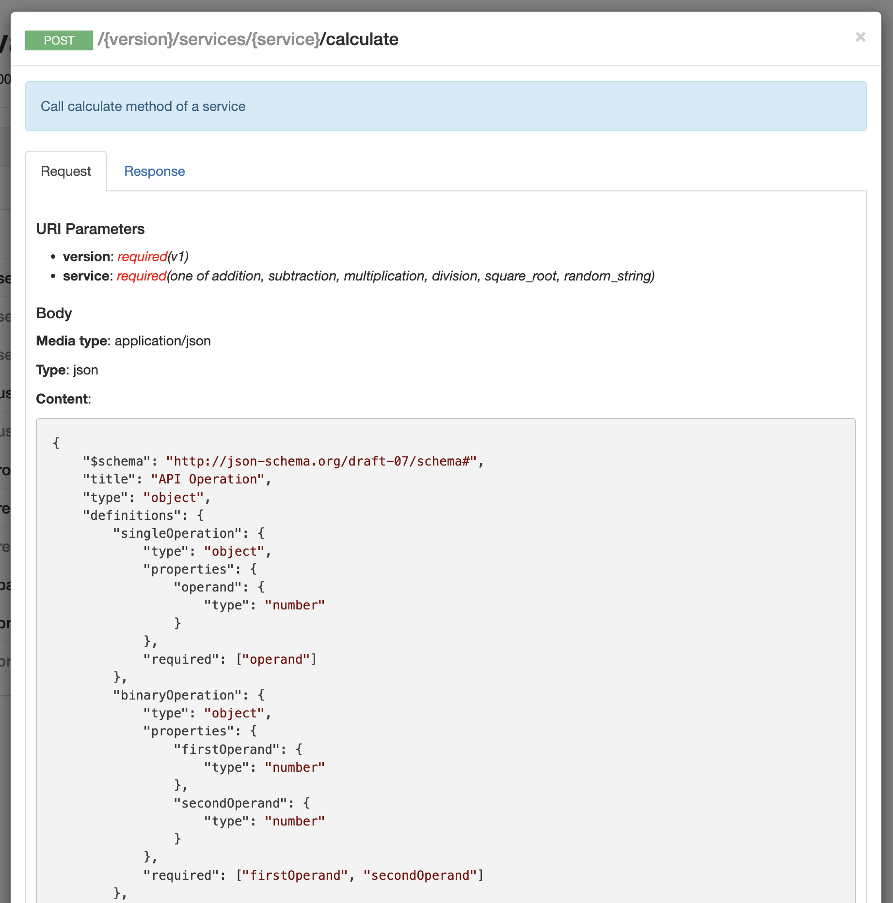
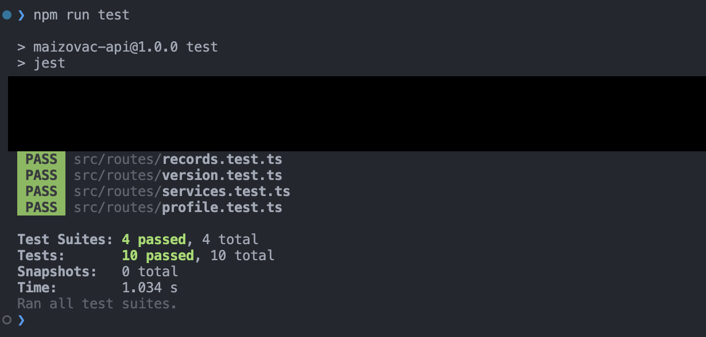

# MaizoVAC API

## The idea

Build a bare bones calculator with the 4 basic operations and some extras with all the logic residing in a [REST API].

## Features

- User CRUD
- Authentication and role management with Auth0 and JWT
- Services:
    - addition
    - substraction
    - multipication
    - division
    - square root
- Keep track of all the service executions made by the user
- Allow changing the status of the services
- Displays a table with all the transactions made by the users

### Assumptions
- Balance/Credit starts in 0 and increments as the User requests a service
- Records are not editable for the sake of integrity of the data history
- Balance/Credit is not editable for the sake of records history 
- Services are not removable, they can only be edited and disabled

## Stack
- [Express.js](https://expressjs.com)
    A Node.js framework that provides a robust set of features for web and mobile applications. 
- [Auth0](https://auth0.com/)
    A third party framework to handle user authentication and RBAC.
- [RAML](https://raml.org/)
    A simple but powerful syntax for modelling APIs.
- [Docker Compose](https://docs.docker.com/compose/)
    A tool for defining and running multi-container Docker applications.
- [Sequelize](https://sequelize.org/master/)
    A promise-based Node.js ORM for Postgres, MySQL, MariaDB, SQLite and Microsoft SQL Server. It features solid transaction support, relations, eager and lazy loading, read replication and more.
- [PostgreSQL](https://www.postgresql.org/)
    A powerful, open source object-relational database system with over 30 years of active development that has earned it a strong reputation for reliability, feature robustness, and performance. 


## Build Setup

**Step 1:** Set env variables  (or .env file)

```bash
# Database env variables
export DATABASE_HOST_PROD=db
export DATABASE_NAME_PROD=postgres
export DATABASE_USER_PROD=postgres
export DATABASE_PASSWORD_PROD=example
 
# API env variables
export PORT_PROD=3000
export AUTHORIZATION_DOMAIN=maizovac.us.auth0.com 
export AUTHORIZATION_AUDIENCE=maizovac-api
export DB_CONNECTION_STRING_PROD=postgres://${DATABASE_USER_PROD}:${DATABASE_PASSWORD_PROD}@${DATABASE_HOST_PROD}:5432/${DATABASE_NAME_PROD}

# Schema migration env vars (seed)
export DEFAULT_USERNAME=root@example.com
```

`AUTHORIZATION_DOMAIN`, `AUTHORIZATION_CLIENT_ID` and  `AUTHORIZATION_AUDIENCE` all are needed as part of the Auth0 service, follow [this](https://auth.nuxtjs.org/providers/auth0) instructions on how to obtain those values. A Auth0 account will be needed.


**Step 2:** Run the server

```bash
# install dependencies
$ npm install

# (Re)creates, starts, and attaches to containers for a service (see stack.yml for more details)
docker-compose -f stack.yml up
```

## Screenshots
- API simple live documentation:



- Expected request/response body:



- Simple testing with [Postman](https://www.postman.com/) (Optional):

