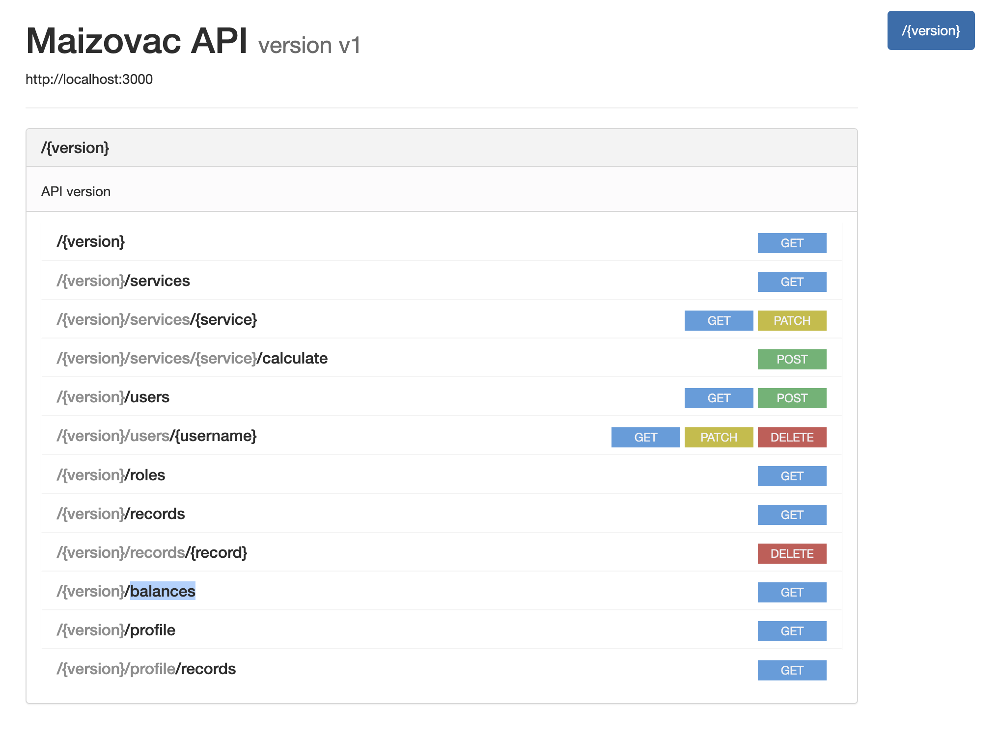

# MaizoVAC API

Service calculator server with the 6 basic operations provided in a [REST API].


## Features

- Authentication with Auth0 and JWT
- Services:
    - addition
    - subtraction
    - multipication
    - division
    - square root
    - random string (external provider)
- Keep track of all the service executions made by the user
- Allow changing the status of the services
- Displays a table with all the transactions made by the users

### Assumptions
- Balance/Credit starts in $10 and decreases as the User requests for a service
- Records can be deleted so that the user balance can be restored
- Services are not removable, they can only be edited and disabled

## Stack
- [Express.js](https://expressjs.com)
    A Node.js framework that provides a robust set of features for web and mobile applications. 
- [Auth0](https://auth0.com/)
    A third party framework to handle user authentication and RBAC.
- [RAML](https://raml.org/)
    A simple but powerful syntax for modelling APIs.
- [Docker Compose](https://docs.docker.com/compose/)
    A tool for defining and running multi-container Docker applications.
- [Sequelize](https://sequelize.org/master/)
    A promise-based Node.js ORM for Postgres, MySQL, MariaDB, SQLite and Microsoft SQL Server. It features solid transaction support, relations, eager and lazy loading, read replication and more.
- [PostgreSQL](https://www.postgresql.org/)
    A powerful, open source object-relational database system with over 30 years of active development that has earned it a strong reputation for reliability, feature robustness, and performance. 
- [Jest](https://jestjs.io/)
    A delightful JavaScript Testing Framework with a focus on simplicity.


## Build Setup

**Step 1:** Set env variables  (or .env file)

```bash
# Database env variables
export DATABASE_HOST=db
export DATABASE_NAME=postgres
export DATABASE_USER=postgres
export DATABASE_PASSWORD=example
 
# API env variables
export PORT=3000
export AUTHORIZATION_DOMAIN=maizovac.us.auth0.com
export AUTHORIZATION_AUDIENCE=maizovac-api
export DB_CONNECTION_STRING=postgres://${DATABASE_USER}:${DATABASE_PASSWORD}@${DATABASE_HOST}:5432/${DATABASE_NAME}

# Schema migration env vars (seed)
export DEFAULT_USERNAME=root@example.com
```

`AUTHORIZATION_DOMAIN`, `AUTHORIZATION_CLIENT_ID` and  `AUTHORIZATION_AUDIENCE` all are needed as part of the Auth0 service, follow [this](https://auth.nuxtjs.org/providers/auth0) instructions on how to obtain those values. A Auth0 account will be needed.


**Step 2:** Run the server

```bash
# install dependencies
$ npm install

# (Re)creates, starts, and attaches to containers for a service (see stack.yml for more details)
docker-compose -f stack.yml up
```


**Step 3:** Migrate and Seed database

```bash
# Open shell inside docker container
docker-compose -f stack.yml exec api sh 

# Run migration and initial seed
source .env
npm run db-migration --production
npm run db-seed --production
```

## Testing

- Main endpoints are tested with Jest via:

```bash
npm run test
```


## Screenshots
- API simple live documentation:



- Expected request/response body:


